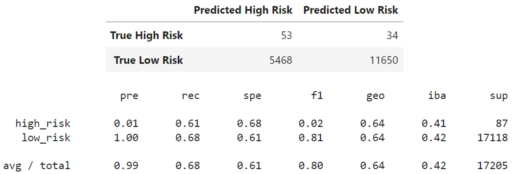
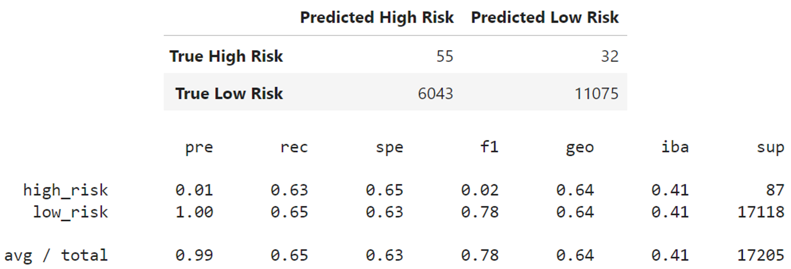
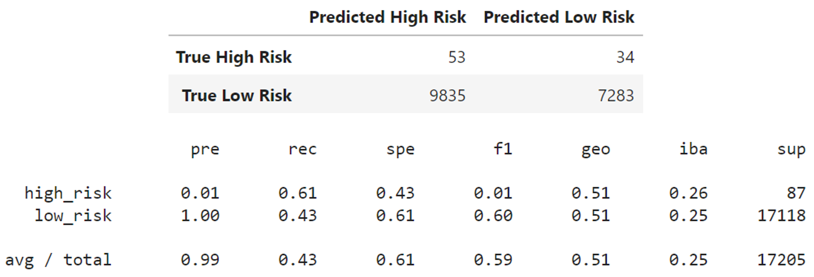
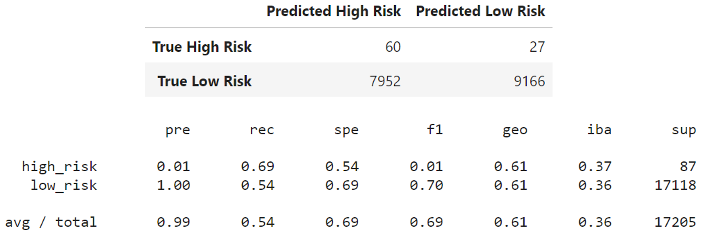
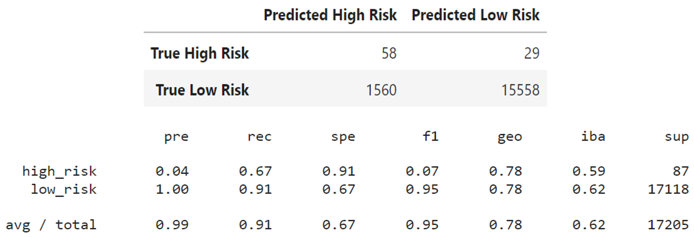

# Credit_Risk_Analysis

## Overview

The objective of this module (**Module 17: Supervised Machine Learning and Credit Risk**) is to conduct supervised machine learning (ML) on user's credit financial data.

Different machine learning models to assess credit risk are produced and evaluated.

A bank or a lending institution's decision on wether approve or not a user's loan application will be based in the ML model prediction.

## Resources

### List of Applications Used

The Scikit-learn and the Imbalanced-learn libraries are used to conduct machine learning in Python.

- _Python 3.9_
- _Scikit-learn 1.1_
- _Imbalanced-learn 0.9.1_
  _Pandas 1.5.2_

### Input Datasets

- **[Users loan statistics](./LoanStats_2019Q1.csv)**
- **[Starter Codes](https://2u-data-curriculum-team.s3.amazonaws.com/dataviz-online/module_17/Module-17-Challenge-Resources.zip)**

## Deliverables

The following is the list of the requested and the provided deliverable files for this modules's challenge.

### Requested Deliverables

- **Deliverable 1:** Use Resampling Models to Predict Credit Risk
- **Deliverable 2:** Use the SMOTEENN Algorithm to Predict Credit Risk
- **Deliverable 3:** Use Ensemble Classifiers to Predict Credit Risk
- **Deliverable 4:** A Written Report on the Credit Risk Analysis (README.md)

### Provided Deliverables

- **[Deliverable 1: & 2 Code](/credit_risk_resampling.ipynb)**
- **[Deliverable 3: Code](./credit_risk_ensemble.ipynb)**
- **[Deliverable 4: Written Analysis](./README.md)**

## Results

The followingf strategy is applied disregarding of the ML algorithm used:

1. Read-in the input data
2. Pre-process the data (cleaning and formatting)
3. Define the features and the target.
4. Split the data into training and testing datasets (75% for trainig and 25% for testing)
5. Re-sample the data (For deliverables 1 & 2 only)
6. Import ML algorithm
7. Fit the data (training process)
8. Make predictions
9. Assess the results

### Deliverable 1

Two oversampling algorithms (Naive random oversampling and the SMOTE algorithm) and one undersampling algorithm (Cluster centroids) are produced.

The following images display the confussion matrix (CM) and the imbalanced classification report (ICR) generated for each algorithm.

_Image01: Naive Random Oversampling CM and ICR_.

_Image02: SMOTE Oversampling CM and ICR_.

_Image03: Cluster Centroids Undersanpling CM and ICR_.

### Deliverable 2

This deliverable consist of a combination of over and undersampling using the SMOTEENN algorithm.

_Image04: SMOTEENN Under and Oversampling CM and ICR_.

### Deliverable 3

Two ensemble algorithms are compared, the Balanced Random Forest Classifier and the Easy Ensemble AdaBoost Classifier.

The following images display the confussion matrix (CM) and the imbalanced classification report (ICR) generated for each algorithm.

_Image05: Balanced Random Forest Classifier CM and ICR_.

_Image06: Easy Ensemble AdaBoost Classifier CM and ICR_.

## Summary

The accuracy score table shows the performance of each of algorithm.

The model created with either of the two oversampling methods can accurately predict about 60% of the observations, however undersampling the data significantly degraded the performance of the accuracy, this is somehow expected as most of the data is being thrown away due to the high class imbalance.

Overall, the ensemble algorithms performed better compared to the resampling algorithms. However the Easy Ensemble AdaBoost Classifier have a significantly higher
sensitivity to predict high risk loan petitions, which is what we are looking for. This algorithm is suggested above any other method tested here.

| **Algorithm**                     | **Accuracy Score** |
| --------------------------------- | ------------------ |
| Naive Random OVersampling         | 0.645              |
| SMOTE                             | 0.640              |
| Cluster Centroids                 | 0.517              |
| SMOTEENN                          | 0.613              |
| Balanced Random Forest Classifier | 0.788              |
| Easy Ensemble AdaBoost Classifier | 0.925              |

_Table01: Accuracy Score_.
